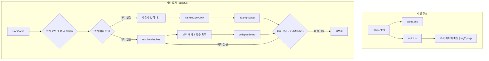

# 보석 매칭 게임 (Jewel Matching Game)

## 게임 방법

1.  **게임 시작**: 웹 페이지를 열면 게임이 자동으로 시작됩니다.
2.  **보석 선택**: 마우스로 보석을 클릭하여 선택합니다. 선택된 보석은 반짝이는 효과를 가집니다.
3.  **보석 교환**: 선택한 보석과 인접한(상, 하, 좌, 우) 보석을 클릭하여 위치를 바꿉니다.
4.  **매치**: 같은 종류의 보석을 가로나 세로로 3개 이상 나란히 놓으면 보석이 터지면서 점수를 얻습니다.
    -   L, T, + 형태 등 여러 줄이 동시에 터지는 복합 매치도 가능합니다.
5.  **연쇄 반응**: 보석이 터지고 새로운 보석이 내려오면서 또 다른 매치가 만들어지면 연쇄 반응(콤보)이 일어나 추가 점수를 얻을 수 있습니다.
6.  **게임 재시작**: `다시하기` 버튼을 누르면 언제든지 게임을 새로 시작할 수 있습니다.

## 점수

-   보석 1개를 터뜨릴 때마다 **15점**을 얻습니다.
-   한 번에 많은 보석을 터뜨리거나 연쇄 반응을 일으키면 더 높은 점수를 획득할 수 있습니다.

## 주요 기능

-   **다양한 보석**: 8가지 종류의 화려한 보석이 등장합니다.
-   **실시간 점수 및 이동 횟수**: 현재 점수와 보석을 움직인 횟수를 실시간으로 확인할 수 있습니다.
-   **애니메이션 효과**: 보석이 선택되거나 터질 때 부드러운 애니메이션 효과가 나타나 게임의 재미를 더합니다.
-   **초기 매치 보너스**: 게임 시작 시 운이 좋게 매치가 완성된 상태라면, 보너스 점수를 얻고 시작할 수 있습니다.

## 게임 구조

## 실행 주소
+ https://pnumin.github.io/sillavibe_game/

## 발표자료 주소
+ https://gamma.app/docs/-mqj8jwscpg9fvz1
  
